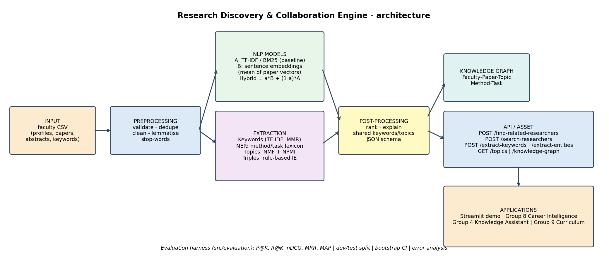

# Research Discovery & Collaboration Engine
**SNLP Course Project 2026 - Group 7 - AI University Platform**
Team: E046 Chaitali Jaibhaye - E049 Himanshi Tripathi - E051 Durva Sawant - E052 Hida Rawal - E053 Dhanya Manam

> Given a faculty member (or a free-text description of interests) the engine returns **related researchers with similarity scores, shared keywords/topics and common research topics**, plus NER/IE output and a small research knowledge graph.



## Reusable-asset test ("what would another group need tomorrow?")
```bash
pip install -r requirements.txt            # numpy pandas scikit-learn networkx matplotlib (+ sentence-transformers optional)
python -m src.api.simple_server --port 8000    # or: uvicorn src.api.app:app --port 8000
curl -X POST localhost:8000/find-related-researchers -H 'Content-Type: application/json' -d '{"faculty_id":"F05","k":3}'
```
**Input:** `faculty_id` (or free text for `/search-researchers`) - **Output:** JSON with related researchers, similarity, shared keywords/topics, common topics - **Docs:** [`docs/API.md`](docs/API.md) - **Python:** `from src.models.engine import load_engine; load_engine().find_related("F05")` - **Example consumer:** [`demo/client_example.py`](demo/client_example.py)

## NLP pipeline
| Stage | Method | Code |
|---|---|---|
| Preprocessing | cleaning, lemmatisation (spaCy or rule-based), stop-words + academic filler | `src/preprocessing/` |
| **Baseline (A)** | TF-IDF (1-2 grams) + cosine; BM25 as second lexical baseline | `src/models/similarity.py` |
| **Improved (B)** | sentence-transformer embeddings, researcher = mean of per-paper vectors; hybrid `a*B+(1-a)*A` (alpha tuned on dev) | `src/models/embedder.py`, `engine.py` |
| Keywords | TF-IDF; embedding re-ranking with MMR | `src/models/keywords.py` |
| Topics | NMF on paper-level TF-IDF, k chosen by NPMI coherence | `src/models/topics.py` |
| NER / IE | method-task-domain lexicon matcher (+ spaCy NER if installed), rule-based triples | `src/models/entities.py` |
| Knowledge graph | networkx: Faculty-Paper-Topic-Method-Task | `src/models/kg.py` |
| Evaluation | P@K, R@K, nDCG, MRR, MAP, bootstrap CI, dev/test split, ablations, robustness, auto error analysis | `src/evaluation/` |

If `sentence-transformers` is missing, the engine **falls back to LSA and labels every output and result table accordingly** - never report LSA numbers as transformer results.

## Reproduce
```bash
python scripts/generate_sample_data.py          # synthetic dev data (already in data/)
python -m unittest discover -s tests -v         # 26 tests
python -m src.evaluation.run_eval               # -> results/*.csv, *.png, evaluation_summary.json
python scripts/make_eval_doc.py                 # -> docs/evaluation.md
streamlit run demo/streamlit_app.py             # interactive demo
```

## Status - read this before submitting
| Item | State |
|---|---|
| Pipeline, API, tests, evaluation harness, KG, docs | **done** (tests pass; stdlib server verified end-to-end) |
| Real dataset | **NOT done.** Repo runs on a *synthetic* sample. Collect real data: `scripts/collect_openalex.py` (untested offline) + manual checking, see `docs/dataset.md` |
| Human relevance labels (2 annotators, kappa) | **NOT done.** `scripts/make_annotation_sheet.py` builds the sheet; guidelines in `docs/annotation_guidelines.md` |
| Transformer results | **NOT run.** The build sandbox had no internet. Run `pip install sentence-transformers` then `python -m src.evaluation.run_eval`; try `RDCE_SENTENCE_MODEL=allenai/specter2_base` |
| FastAPI app / Streamlit demo | written, **not executed** in the build sandbox (packages unavailable) - run once and fix any environment issue |
| Cross-group integration | schema + client example done; **live call with a partner group still to do** (`docs/integration.md`) |
| Report / slides | draft in `report/`, outline in `docs/presentation_outline.md`; numbers must be refreshed after the real run |

## Repository layout
```
data/  notebooks/  src/{preprocessing,models,evaluation,api}/  tests/  results/  docs/  demo/  scripts/  report/
```
## Use of generative AI (handout section 20)
An AI assistant (Claude, Anthropic) helped generate code scaffolding, synthetic data and documentation drafts. No student data was sent to it. The team must be able to explain every component; edit this section to reflect your own contribution and which parts you reviewed/changed.
