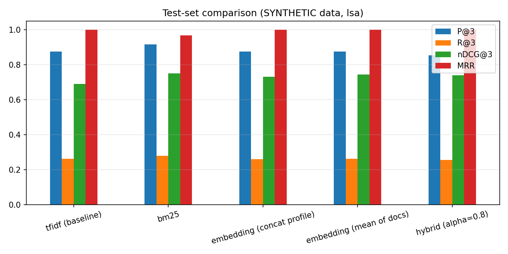

# Evaluation Report (auto-generated)

`DATA=SYNTHETIC | EMBEDDER=LSA-fallback | relevance=pairs:/home/claude/SNLP-PROJECT/data/sample_relevance_pairs.csv | queries dev/test=16/16`

> **WARNING - SYNTHETIC DATA.** Numbers validate the pipeline only. Labels were derived from area tags written together with the data. Do **not** report as final results.

> **WARNING - no transformer installed.** Rows named `embedding` use the LSA fallback (TF-IDF + SVD), not sentence-transformers. Install `sentence-transformers` and re-run to obtain the real Approach-B numbers.

## Protocol
- Queries = researchers; split 50/50 into **dev/test** (stratified by department, seed 42). The only tuned hyper-parameter (hybrid alpha) is chosen on dev by nDCG@3; all tables below are **test** queries.
- Relevance is graded 0/1/2. *Loose* = label >= 1 counts as relevant; *strict* = label 2 only. Metrics: P@K, R@K, nDCG@K (gain 2^rel-1), MRR, MAP; 95% bootstrap CI (1000 resamples over queries).
- Alpha tuning on dev (nDCG@3): `{'0.0': 0.731, '0.2': 0.734, '0.4': 0.771, '0.5': 0.801, '0.6': 0.801, '0.8': 0.805, '1.0': 0.805}` -> alpha = **0.8**.
- Dataset: `{'faculty': 32, 'paper_rows': 96, 'departments': 5, 'papers_per_faculty_mean': 3.0, 'abstract_words_mean': 21.2, 'abstract_words_min': 9, 'abstract_words_max': 51, 'empty_abstracts': 0, 'empty_keywords': 0}`

## Baseline vs improved (test) - loose relevance
|                            |   P@1 |   P@3 |   R@3 |   P@5 |   nDCG@3 | nDCG@3_CI95   |   MRR |   MAP |
|:---------------------------|------:|------:|------:|------:|---------:|:--------------|------:|------:|
| tfidf (baseline)           | 1     | 0.875 | 0.262 | 0.8   |    0.691 | [0.60, 0.78]  | 1     | 0.79  |
| bm25                       | 0.938 | 0.917 | 0.28  | 0.85  |    0.752 | [0.65, 0.84]  | 0.969 | 0.817 |
| embedding (concat profile) | 1     | 0.875 | 0.26  | 0.838 |    0.732 | [0.64, 0.82]  | 1     | 0.769 |
| embedding (mean of docs)   | 1     | 0.875 | 0.262 | 0.775 |    0.745 | [0.65, 0.84]  | 1     | 0.72  |
| hybrid (alpha=0.8)         | 1     | 0.854 | 0.257 | 0.775 |    0.74  | [0.64, 0.83]  | 1     | 0.733 |

## Strict relevance (label 2 only)
|                            |   P@1 |   P@3 |   R@3 |   P@5 |   nDCG@3 | nDCG@3_CI95   |   MRR |   MAP |
|:---------------------------|------:|------:|------:|------:|---------:|:--------------|------:|------:|
| tfidf (baseline)           | 0.625 | 0.562 | 0.562 | 0.425 |    0.691 | [0.60, 0.78]  | 0.788 | 0.645 |
| bm25                       | 0.812 | 0.625 | 0.625 | 0.463 |    0.752 | [0.65, 0.84]  | 0.884 | 0.72  |
| embedding (concat profile) | 0.688 | 0.625 | 0.625 | 0.45  |    0.732 | [0.64, 0.82]  | 0.809 | 0.687 |
| embedding (mean of docs)   | 0.812 | 0.625 | 0.625 | 0.425 |    0.745 | [0.65, 0.84]  | 0.882 | 0.694 |
| hybrid (alpha=0.8)         | 0.812 | 0.625 | 0.625 | 0.425 |    0.74  | [0.64, 0.83]  | 0.882 | 0.698 |

## Robustness: how much text is needed? (test, nDCG@3 / P@3 / MRR)
|                                  |   P@3 |   R@3 |   nDCG@3 |   MRR |
|:---------------------------------|------:|------:|---------:|------:|
| ('full', 'tfidf')                | 0.875 | 0.262 |    0.691 | 1     |
| ('full', 'embedding')            | 0.875 | 0.262 |    0.745 | 1     |
| ('full', 'hybrid')               | 0.854 | 0.257 |    0.74  | 1     |
| ('titles_keywords', 'tfidf')     | 0.979 | 0.299 |    0.792 | 1     |
| ('titles_keywords', 'embedding') | 0.958 | 0.29  |    0.773 | 1     |
| ('titles_keywords', 'hybrid')    | 0.979 | 0.299 |    0.785 | 1     |
| ('interests_only', 'tfidf')      | 0.562 | 0.164 |    0.488 | 0.859 |
| ('interests_only', 'embedding')  | 0.562 | 0.164 |    0.475 | 0.891 |
| ('interests_only', 'hybrid')     | 0.562 | 0.17  |    0.484 | 0.88  |

## Keywords and topics
- Keyword hit-rate against author-supplied keywords (top-8): `{'tfidf': 0.855, 'embedding (MMR)': 0.551}` (circular for TF-IDF, which sees the keywords as text - treat as a sanity check only).
- NMF topics: k = 6 chosen by NPMI coherence = 0.6158 (k-selection: `{'6': 0.6158, '7': 0.4621, '8': 0.4112, '9': 0.4529, '10': 0.4246, '11': 0.362, '12': 0.3378}`).

## Error analysis (top-3 hybrid false positives; 11 in total)
|    | query   | wrong_match   |   hybrid_score |   tfidf_rank |   embedding_rank | shared_terms                                                                       | likely_cause                                                                             |
|---:|:--------|:--------------|---------------:|-------------:|-----------------:|:-----------------------------------------------------------------------------------|:-----------------------------------------------------------------------------------------|
|  0 | F31     | F23           |          0.474 |            2 |                2 | neural network, embedding neural, learning embedding, network benchmark, benchmark | both lexical and semantic signals mislead (shared generic ML vocabulary / bridge topics) |
|  1 | F23     | F31           |          0.474 |            2 |                3 | neural network, embedding neural, learning embedding, network benchmark, benchmark | both lexical and semantic signals mislead (shared generic ML vocabulary / bridge topics) |
|  2 | F19     | F31           |          0.454 |            3 |                2 | neural network, learning embedding, network benchmark, embedding neural, deep      | both lexical and semantic signals mislead (shared generic ML vocabulary / bridge topics) |
|  3 | F31     | F19           |          0.454 |            3 |                3 | neural network, learning embedding, network benchmark, embedding neural, deep      | both lexical and semantic signals mislead (shared generic ML vocabulary / bridge topics) |
|  4 | F07     | F23           |          0.453 |            3 |                3 | neural network, embedding neural, learning embedding, network benchmark, embedding | both lexical and semantic signals mislead (shared generic ML vocabulary / bridge topics) |
|  5 | F19     | F07           |          0.452 |            2 |                3 | neural network, network benchmark, embedding neural, learning embedding, embedding | both lexical and semantic signals mislead (shared generic ML vocabulary / bridge topics) |
|  6 | F15     | F23           |          0.446 |            3 |                3 | neural network, network benchmark, learning embedding, embedding neural, deep      | both lexical and semantic signals mislead (shared generic ML vocabulary / bridge topics) |
|  7 | F03     | F07           |          0.431 |            5 |                2 | neural network, embedding, network benchmark, embedding neural, learning embedding | semantic over-generalisation: embedding places different areas close                     |
|  8 | F11     | F07           |          0.425 |            3 |                4 | neural network, embedding, network benchmark, embedding neural, learning embedding | lexical overlap: shared surface vocabulary, different research area                      |
|  9 | F03     | F11           |          0.419 |            3 |                4 | neural network, embedding, learning embedding, network benchmark, embedding neural | lexical overlap: shared surface vocabulary, different research area                      |
| 10 | F27     | F19           |          0.417 |            2 |                3 | network benchmark, embedding neural, learning embedding, neural network, deep      | both lexical and semantic signals mislead (shared generic ML vocabulary / bridge topics) |

## How to read these results
- Overlapping bootstrap CIs mean differences between methods are **not statistically established** with this many queries; say so in the report rather than declaring a winner.
- Typical failure: researchers who append generic ML vocabulary (deep learning, embeddings, benchmark) get matched to unrelated areas by *every* method - add domain-specific stop-lists or weight curated keywords.
- Paraphrase-heavy profiles are where transformer embeddings are expected to beat lexical methods; verify on real data.