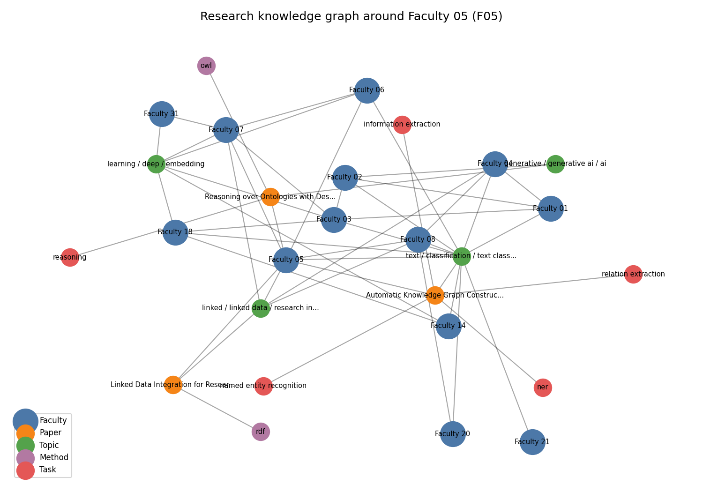

> **DRAFT STATUS - delete this box before submission.** All numbers below come from the repository's *synthetic* development dataset (32 fictional faculty) with the LSA fallback standing in for transformer embeddings. They validate the pipeline and the evaluation design; they are **not** final results. After collecting real data, annotating pairs and installing `sentence-transformers`, run `python -m src.evaluation.run_eval` and replace Section 11-12 with the new numbers (`docs/evaluation.md` regenerates automatically). Passages marked **[TEAM]** need your own input.

# 1. Problem Statement
Faculty working on related topics often do not know about each other's work. Finding collaborators or supervisors means manually reading profiles, abstracts and publication lists. We build an NLP component that, for a given faculty member (or a free-text description of interests), returns the most related researchers with similarity scores, the topics they share, and evidence for the match.

# 2. Institutional Context
Users: faculty looking for collaborators; research scholars and students looking for guides; department heads and the research office mapping overlapping areas. The engine is advisory - it surfaces candidates; people decide. It is one asset of the AI University platform (Section 13) and consumes text produced elsewhere (faculty profiles, papers, circulars).

# 3. Existing Approaches
Bibliographic services (Google Scholar, Scopus/Pure "find experts", ResearchGate) match by keyword and co-authorship but are not institution-specific and give little explanation. Research-information systems such as VIVO use manually curated ontologies. In NLP, TF-IDF/BM25 [Robertson & Zaragoza, 2009] are strong lexical baselines; Sentence-BERT [Reimers & Gurevych, 2019] and SPECTER [Cohan et al., 2020] provide semantic and citation-informed paper embeddings; KeyBERT-style methods [Grootendorst, 2020] rank candidate phrases with embeddings; NMF topic models [Lee & Seung, 1999] give interpretable topics. We combine these into one explainable, reusable component rather than inventing a new model.

# 4. NLP Formulation
*Research text -> representation -> similarity -> ranked related researchers + common topics.* Formally, each researcher $r$ is a set of documents $D_r$ (interests and papers). We learn a function $s(r_i, r_j)\in[0,1]$ and rank all $r_j\ne r_i$ by $s$; evaluation treats this as **ad-hoc retrieval** with graded relevance (0/1/2). Supporting tasks: keyword extraction, topic modelling, NER/information extraction, and knowledge-graph construction.

# 5. Dataset
Documented fully in `docs/dataset.md`. **Shipped:** synthetic, 32 faculty x 3 papers (96 rows, 5 departments, abstracts 9-51 words), generated with fixed seed. Difficulty is injected deliberately: 8 *paraphrase* faculty whose domain terms are replaced by descriptive paraphrases (little lexical overlap with peers) and 8 *trap* faculty whose abstracts carry generic ML boilerplate ("deep neural networks, embeddings, benchmark") shared across unrelated areas. Labels: derived pair relevance (496 pairs: 48 strict, 126 partial, 322 unrelated). **[TEAM]** Real data: >=40 NMIMS faculty with >=5 papers, collected with `scripts/collect_openalex.py` and manually verified; two annotators label a pooled set of pairs (`scripts/make_annotation_sheet.py`) and we report Cohen's kappa. Only public bibliographic metadata is used; no student data.

# 6. Preprocessing
Schema validation; NaN/whitespace cleaning; de-duplication of (faculty, title, abstract); lowercasing and punctuation removal (hyphens kept: *low-resource*, *U-Net*); lemmatisation with spaCy if available, otherwise a rule-based plural normaliser that preserves words like *analysis*; English stop-words plus academic filler (*propose, approach, novel, results*). A researcher profile is interests + titles + abstracts + keywords, with interests and curated keywords repeated once to up-weight curated signal.

# 7. Baseline (Approach A)
TF-IDF over uni+bigrams (sublinear tf) of the concatenated profile, cosine similarity, ranking. A second lexical baseline, BM25, uses each profile as a query. Both are fast, transparent and need no training.

# 8. Proposed Method (Approach B)
**Semantic representation:** a sentence-transformer (`all-MiniLM-L6-v2`; SPECTER2/SciBERT configurable) encodes every document of a researcher (interests, each paper) and the researcher vector is the **mean of those vectors**. This avoids the 256-512 token truncation that harms one long concatenated profile and gives every paper equal weight. **Hybrid:** $s=\alpha\,s_{emb}+(1-\alpha)\,s_{tfidf}$, with $\alpha$ tuned on the dev split only. **Explanations:** shared curated keywords, shared TF-IDF terms, shared NMF topics. **Keywords:** TF-IDF and embedding ranking of n-gram candidates with Maximal Marginal Relevance. **Topics:** NMF on paper-level TF-IDF, number of topics chosen by NPMI coherence. **NER/IE:** a METHOD/TASK/DOMAIN lexicon matcher (general NER models do not know *U-Net* or *entity linking*), optional spaCy NER, and rule-based (paper, USES/ADDRESSES, entity) triples. **Knowledge graph:** Faculty-PUBLISHED-Paper, Faculty-WORKS_ON-Topic, Paper-USES-Method, Paper-ADDRESSES-Task, Paper-RELATED_TO-Topic, Faculty-COLLABORATION_CANDIDATE-Faculty (networkx).
*Implementation note:* in the build environment the transformer could not be downloaded, so "embedding" rows below are **LSA** (TF-IDF+SVD, 24 components), a weaker stand-in. **[TEAM]** re-run with sentence-transformers.

# 9. Architecture
{width=100%}

# 10. Experiments
Queries are researchers (16 dev / 16 test, stratified by department, seed 42). Methods: TF-IDF (baseline), BM25, embedding (concatenated profile, ablation), embedding (mean of documents), hybrid. Only $\alpha$ is tuned (dev nDCG@3; best $\alpha=0.8$). Metrics: P@K, R@K, nDCG@K, MRR, MAP; 95% bootstrap CIs over queries. Two relevance thresholds: *loose* (label >= 1) and *strict* (label 2). Additional experiments: robustness to the amount of profile text, a faculty-type slice analysis, keyword hit-rate and topic coherence.

# 11. Results (test split, synthetic data, LSA fallback)

| Method | P@3 (loose) | nDCG@3 [95% CI] | MRR | MAP | P@3 (strict) |
|---|---|---|---|---|---|
| TF-IDF (baseline) | 0.875 | 0.691 [0.60, 0.78] | 1.000 | 0.790 | 0.562 |
| BM25 | 0.917 | 0.752 [0.65, 0.84] | 0.969 | 0.817 | 0.625 |
| Embedding (concatenated) | 0.875 | 0.732 [0.64, 0.82] | 1.000 | 0.769 | 0.625 |
| Embedding (mean of docs) | 0.875 | 0.745 [0.65, 0.84] | 1.000 | 0.720 | 0.625 |
| Hybrid ($\alpha$=0.8) | 0.854 | 0.740 [0.64, 0.83] | 1.000 | 0.733 | 0.625 |

{width=75%}

**Reading the table.** All improved variants beat TF-IDF on nDCG@3 by 0.04-0.06 (BM25 +0.06), but the bootstrap intervals overlap heavily with only 16 test queries, so **we cannot claim a statistically established winner**. MAP actually favours the lexical methods. Mean-of-documents embedding beats concatenation slightly (0.745 vs 0.732), consistent with the truncation argument but within noise.

**By faculty type (strict P@3 / nDCG@3):** plain faculty 0.73-0.77 / 0.85-0.88 for all methods; paraphrase faculty 0.58-0.62 / 0.72-0.76; **trap faculty** TF-IDF 0.25 / 0.42, BM25 0.33 / 0.48, embedding 0.42 / 0.58. Semantic representations help most exactly where lexical overlap is misleading.

**Robustness (nDCG@3, hybrid):** full text 0.74, titles+keywords only 0.79, research-interest sentence only 0.48 - abstracts add noise on this synthetic set while a one-line interest statement is clearly insufficient. **Keywords:** TF-IDF top-8 overlap with author keywords 0.86 vs 0.55 for LSA-embedding MMR (expected to change with a transformer; the metric favours TF-IDF because it sees the keywords as text). **Topics:** NMF with k=6 chosen by NPMI (0.62).

# 12. Error Analysis
The hybrid ranking places an unrelated researcher in a top-3 list 11 times (`results/error_analysis.csv`). **All 11 involve two "trap" faculty** (boilerplate-laden abstracts); the ten highest-scoring are analysed here (the eleventh, F27 -> F19 at 0.417, has the same cause):

| # | Query -> wrong match | Score | Why it failed |
|---|---|---|---|
| 1 | F31 (data mining) -> F23 (security) | 0.474 | shared *neural network, embedding, benchmark* from appended boilerplate; both lexical and semantic ranks 2-3 |
| 2 | F23 -> F31 | 0.474 | symmetric counterpart of #1 |
| 3 | F19 (health) -> F31 | 0.454 | generic ML vocabulary dominates the short profiles |
| 4 | F31 -> F19 | 0.454 | symmetric |
| 5 | F07 (knowledge graphs) -> F23 | 0.453 | boilerplate terms outweigh two domain terms |
| 6 | F19 -> F07 | 0.452 | boilerplate again; embedding rank 3, TF-IDF rank 2 |
| 7 | F15 (vision) -> F23 | 0.446 | shared *deep learning* keyword added to every trap profile |
| 8 | F03 (NLP) -> F07 | 0.431 | embedding-driven (rank 2) while TF-IDF rank 5: semantic over-generalisation inside the LSA space |
| 9 | F11 (LLM) -> F07 | 0.425 | lexical overlap (TF-IDF rank 3, embedding rank 4) |
| 10 | F03 -> F11 | 0.419 | lexical overlap through the same boilerplate sentences |

*Diagnosis:* boilerplate vocabulary shared across areas is the dominant failure; no model is robust to it because it is *genuinely* shared text. *Mitigations to test on real data:* domain-specific stop-lists (learn terms with high document frequency across departments), weight curated keywords more, use paper-level matching (max over paper pairs rather than the mean), and cross-encoder re-ranking. *Failure to demonstrate live:* query F31 and show F23 in the top-3.

# 13. Reusability
A single `ResearchDiscoveryEngine` is exposed as a Python module and a JSON API (`/find-related-researchers`, `/search-researchers`, `/extract-keywords`, `/extract-entities`, `/topics`, `/knowledge-graph`); see `docs/API.md` and `demo/client_example.py`. Integration points (`docs/integration.md`): **Group 8** (faculty methods/skills seed a skill ontology; job text -> matching faculty), **Group 4** (faculty cards as retrievable documents), **Group 9** (course outcomes -> topics -> faculty expertise). **[TEAM]** add the result of one live call with a partner group.

# 14. Responsible AI
*Privacy:* only public metadata, names replaceable by IDs, faculty consent before deployment. *Bias:* prolific authors and well-indexed fields have richer profiles; mean-pooling reduces but does not remove this; audit retrieval rates per department/seniority. *Hallucination:* none - all outputs are retrieved or extracted. *Explainability:* each match lists shared keywords/terms/topics. *Security:* input validation and length limits; if an LLM component is ever added, inputs (abstracts are untrusted text) should be screened by Group 12's module. *Human oversight:* scores are relative rankings, every response carries a disclaimer; the tool never ranks research quality. Full statement: `docs/responsible_ai.md`.

# 15. Limitations
Results rest on synthetic data with circular labels and 16 test queries - no conclusion about the real institution is justified yet. Lexicon NER misses unseen methods; no entity linking to external ontologies; English only; similarity is relative, not calibrated; O(n^2) matrices; no authentication or rate limiting; profiles go stale without a refresh process; pooled annotation understates recall.

# 16. Future Work
Evaluate SPECTER2/SciBERT and a cross-encoder re-ranker; SciSpaCy NER and entity linking; learn domain stop-lists; co-authorship and citation features; calibrated scores; authentication, caching and incremental indexing for production; scheduled OpenAlex refresh; faculty-facing consent and correction workflow; graph database for the knowledge graph.

# Appendix A - Knowledge-graph example
{width=85%}

# Appendix B - LLM/tool usage disclosure
An AI coding assistant (Claude) helped draft code, synthetic data and documentation. It was not used at run time and no student data was shared. **[TEAM]** describe what you reviewed and changed.

# References
Cohan et al. (2020) SPECTER: Document-level representation learning using citation-informed transformers. ACL. - Grootendorst (2020) KeyBERT. - Lee & Seung (1999) Learning the parts of objects by non-negative matrix factorization. Nature. - Priem et al. (2022) OpenAlex. arXiv:2205.01833. - Reimers & Gurevych (2019) Sentence-BERT. EMNLP. - Robertson & Zaragoza (2009) The probabilistic relevance framework: BM25 and beyond. FnTIR.
